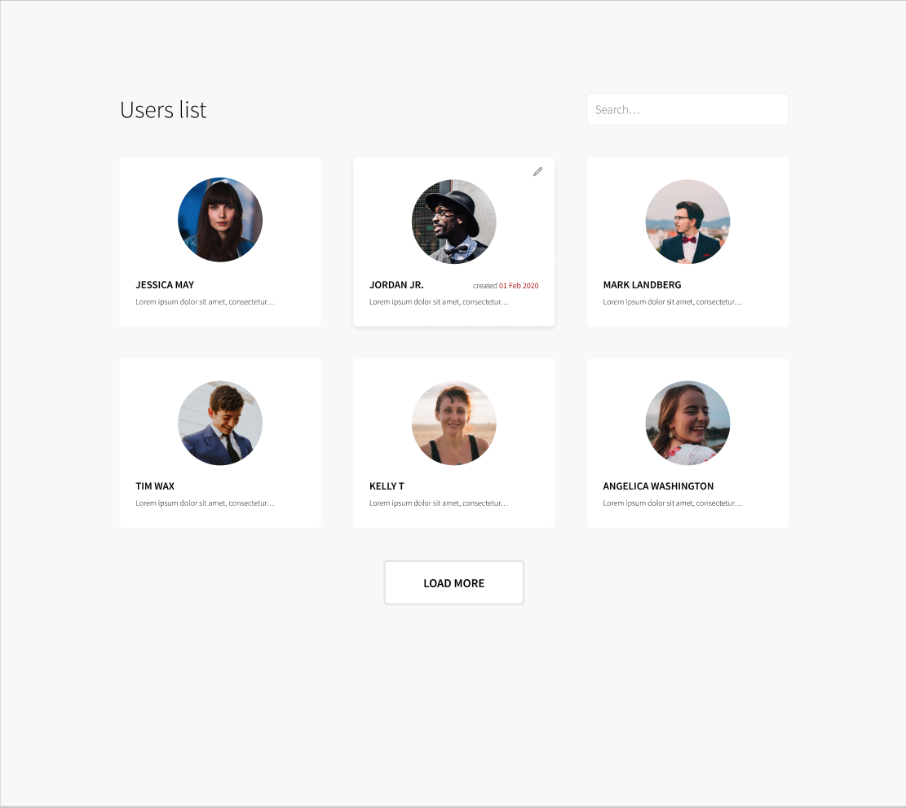
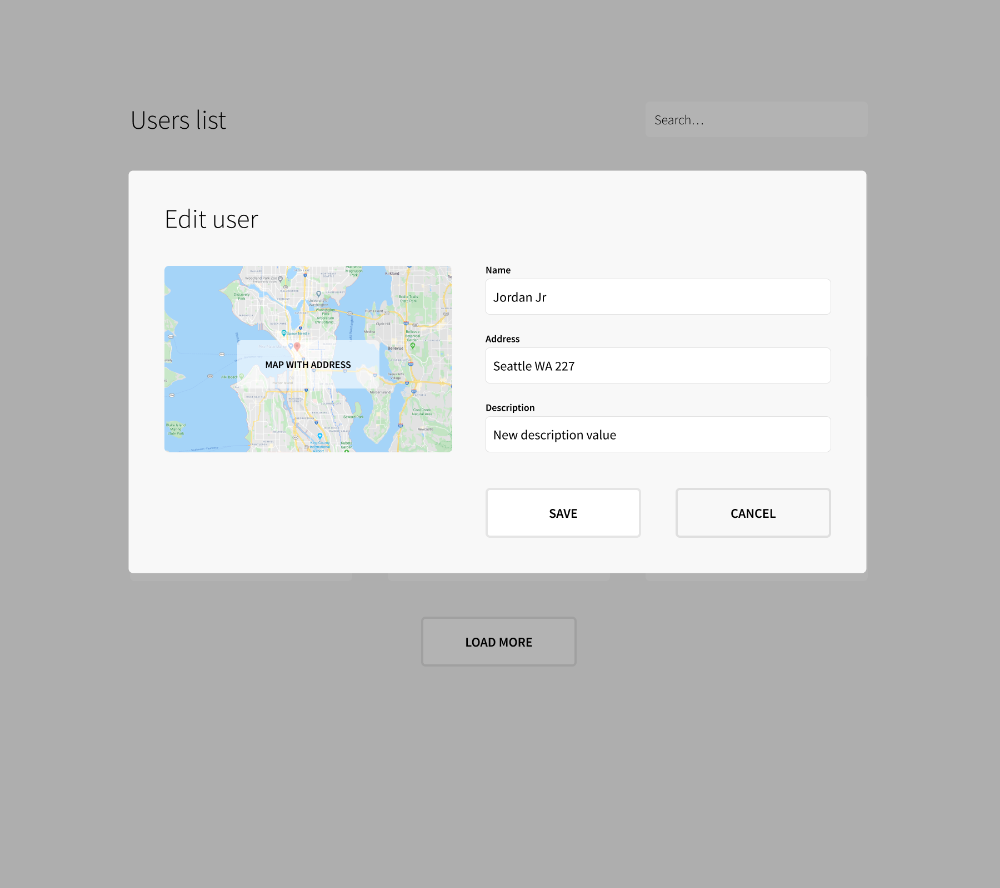

# Superformula Frontend Test

Be sure to read **all** of this document carefully, and follow the guidelines within.

- **Please remember to update README with instructions on how to run a project. Ideally, we should be able to run it with one command. Please also include all required environment variables, or send them by email.**

- **After finishing the work, please create your own, public repo and send us a link to it (or if that is a problem, just send us a project in a zip file)**

- **If you have anything that you would like to improve in your app in case of more time, feel free to add “Improvements” section in README and outline it all there.**

## Task

Use HTML, CSS, and React (or Next.js) to implement the following mock-up. You are only required to complete the desktop views, unless otherwise instructed. Application should connect to [CRUD API](#api). If you have a limited amount of time, it is preferred you create one fully covered feature - edit user functionality (including accessibility, unit tests, e2e tests, storybook stories) instead of the partially implemented whole app.

[Source Figma file](https://www.figma.com/file/hd7EgdTxJs2fpTzzSKlNxo/Superformula-full-stack-test)





### API

Please use this API - https://crudcrud.com/ to create/read/update users.

User model should look like this:
```
{
  "name": "backend test",       // user name
  "address": "",                // user address
  "description": "",            // user description
  "createdAt": ""               // user created date
  "updatedAt": ""               // user updated date
}
```

### Required functionality

- Create edit user modal from scratch - please don't use any library for it
- Appear/Disappear of modal should be animated (feel free with choose how)
- List of users should be updated automatically after single user is updated

### Tech stack

- JS oriented (**Typescript preferred**)
- Use **React**
- Use unsplash.com to show random avatar images
- You don't have to write configuration from scratch (you can use eg. CRA for React application)
- Feel free to use a preprocessor like SASS/SCSS/Less or CSS in JS
- Provide unit tests (one component well tested is enough)
- Please **do not** use any additional libraries with predefined styles (e.g. `react-bootstrap`, `material-ui` or similar)

### Bonus (in order)

1. Providing e2e tests with on fully tested view is welcomed
1. Providing an online demo is welcomed (e.g. using Vercel or Netlify)
1. Write documentation on how the app was designed
1. Create infinite loading (infinite loading state should be saved in url query - pagination state should be present in URL query (e.g. `?page=1`) to allow for behavior where the user can reload the page while still returning to their current scroll position)
1. Show user location on a map, map with user location should update async - when user changes "location" field (feel free to choose MAPS service e.g. GoogleMaps, OpenStreetMap)
1. Provide a description of how you approach mobile friendly apps (what do you use, how)
1. Provide components in [Storybook](https://storybook.js.org)
1. Implement search functionality
1. Write concise and clear commit messages
1. Include subtle animations to focus attention
1. Describe optimization opportunities when you conclude


## What We Care About
We expect you to treat this assignment as if it were a production app with everything implied you do in a production grade project.

Use any libraries that you would normally use if this were a real production App. Please note: we're interested in your code & the way you solve the problem, not how well you can use a particular library or feature.

_We're interested in your method and how you approach the problem just as much as we're interested in the end result._

Here's what you should strive for:

- **Application to look the same as designs (sizes, spacings, fonts, icons, etc), with attention to details.**
- Good use of current HTML, CSS, JavaScript/Typescript & performance best practices
- Solid testing approach
- Extensible code

## Q&A
> Where should I send back the result when I'm done?

Open a new public repo on your github account or create a zip with project and send us an email.

> What if I have a question?

Create a new issue in this repo and we will respond and get back to you quickly.

> Should I validate inputs?

Please assume a hard requirement has not been set by the product owner. We welcome any input validations and your reasoning for why they add value.

> What is the location format?

Examples:
- Seattle, Washington
- Digital Nomad
- New Jersey
- Northern Bergen County, NJ

> I almost finished, but I don't have time to create everything what is required

Please provide a plan for the rest of the things that you would do.

> I want to remain privacy of my submission and not expose it in my GitHub account

Feel free to create new GitHub account and open a PR from it.

